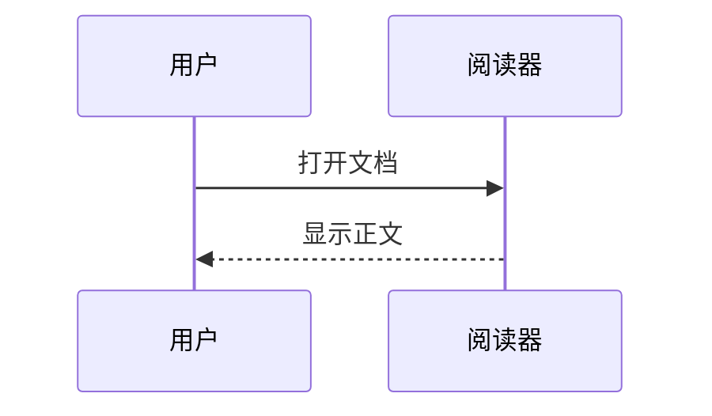

# 本地 Markdown 阅读器

这是桌面阅读器的本地示例。**粗体**、*斜体*、`行内代码` 和中文排版。

## 文件导航

[打开第二篇文档](第二篇.md) · [跳到公式](#公式) · [访问 Tauri 官网](https://v2.tauri.app/)

通过“打开目录”选择本示例目录，即可加载相对图片：


## 常见格式

> [!NOTE]
> 文件只在本机渲染，不会发送给 AI 服务。

- [x] 本地阅读
- [ ] 编辑和同步不在本版范围内

| 能力 | 实现 |
| --- | --- |
| 桌面窗口 | Tauri |
| 文件访问 | Rust 只读授权 |

```typescript
const greeting = "Hello, Markdown";
console.log(greeting);
```

脚注示例。[^note]

[^note]: 脚注正文。

## 公式

行内公式 $e^{i\pi}+1=0$。

$$
\int_0^1 x^2\,dx = \frac{1}{3}
$$

## 流程图


## 序列图



## 原始 HTML

<details><summary>展开查看</summary><p>安全的 HTML 内容可以正常显示。</p></details>
